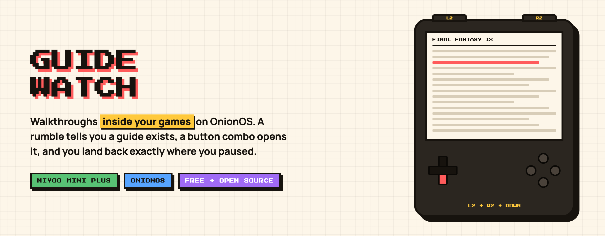
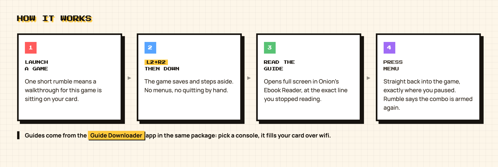

<p align="center">
  
</p>

<p align="center">
  <a href="https://github.com/djaysan/guide-watch/releases/latest"></a>
  
  
  <a href="LICENSE"></a>
</p>

---

Stuck on a puzzle, a boss, a missable item. You put the handheld down and reach for your phone. **Guide Watch** keeps the walkthrough on the device instead: play a game and a short rumble tells you a guide is there, hold **L2 + R2** and press **Down** to read it, press **MENU** to drop straight back into the game where you paused.

It is the "in-game guide" experience from the Anbernic StockOS mod, rebuilt for OnionOS, plus something that mod never had: an app that downloads the guides for your games on the device itself, over wifi.

## Download

Grab **`GuideWatch-OnionOS.zip`** from the [latest release](https://github.com/djaysan/guide-watch/releases/latest/download/GuideWatch-OnionOS.zip), unzip it, and copy the two folders onto your SD card, merging them with what is already there:

| From the zip | Onto the card |
|---|---|
| `App/GuideWatch/` | `SDCARD/App/GuideWatch/` |
| `App/GuideDownload/` | `SDCARD/App/GuideDownload/` |
| `.tmp_update/startup/guidewatch.sh` | `SDCARD/.tmp_update/startup/guidewatch.sh` |

Reboot. That is the whole install: no patching, nothing overwritten, delete the folders to uninstall.

> On Windows the `.tmp_update` folder is hidden by default. Turn on hidden files, or drag `App/` first and copy the startup script separately.

<p align="center">
  
</p>

## Two apps, one package

**Guide Watch** is the daemon. It starts with the console, notices when a game you have a guide for is running, and handles the rumble cue, the button combo and the return trip.

**Guide Downloader** is how the guides get there. Open it from the Apps menu with wifi on, and it scans your `Roms` folders, counts what is missing, and lets you fetch guides for every console at once or just one at a time. Guides land next to each ROM as `Game Name.txt`, which is exactly where Guide Watch looks for them.

The two ship together because they are two halves of the same thing, and because keeping one download link means one thing to update.

## What you need

- A **Miyoo Mini Plus** running **OnionOS** (any version with the `.tmp_update/startup` folder, which is Onion 4.2 and later).
- The **Ebook Reader** app, installed from Onion's own Package Manager. Guide Watch shows guides through it, and it is what remembers your reading position per guide.
- Wifi, for the downloader only. Guide Watch itself is entirely offline.
- Onion's **Auto save** setting on, which is the default. That is what makes the return trip land you exactly where you were.

RetroArch games are supported. Standalone emulators like DraStic are not.

## Where the guides come from

Walkthroughs are plain text FAQs from the GameFAQs archive hosted on [archive.org](https://archive.org/details/Gamespot_Gamefaqs_TXTs). The downloader matches your ROM names against an index and pulls each guide directly from archive.org to your card.

**This repository contains no guide files, and neither does the index.** Nothing is rehosted. If you would rather do this from a computer, the browser version is at [guides.retromodlab.com](https://guides.retromodlab.com) and writes the same `Game Name.txt` files to the same places.

## Notes from the device

Three things the Miyoo taught me, written down for anyone porting this to another handheld:

1. **Nothing can be drawn over a paused RetroArch.** The frozen game frame stays composited on top, so the first version ran the reader invisibly behind it. Guide Watch instead saves and quits the game, shows the guide, then relaunches with the save state, using the same quick-switch mechanism Onion's own Game List Options uses.
2. **Onion deletes `cmd_to_run.sh` after every program exits** unless `/tmp/quick_switch` exists. Without that flag, a handoff lands on the main menu instead of your guide.
3. **The busybox `awk` on this device fails on bracket-expression regexes**, silently returning an empty string. String work here is done with shell built-ins for that reason.

## Build from source

The daemon is a single C file, cross compiled in the same Docker toolchain image OnionOS itself uses:

```sh
git clone https://github.com/djaysan/guide-watch.git
cd guide-watch/onion
./build.sh
```

It runs the host self-test first, then produces a static ARM binary at `sd-package/App/GuideWatch/guidewatch`, leaving `sd-package/` ready to copy onto a card. The downloader is plain shell and needs no build step.

More detail, including the on-device test checklist, is in [onion/README.md](onion/README.md).

## Other handhelds

OnionOS came first. The same idea should port to spruceOS (A30, Flip, TrimUI Brick), stock TrimUI Brick, and Allium on the Miyoo Flip, each as its own folder in this repo. If you want one of those next, open an issue and say which device you have.

## Credits

- [OnionUI](https://github.com/OnionUI/Onion) for the firmware this is built on, and for a source tree clear enough to learn its internals from.
- [pixel-reader](https://github.com/ealang/pixel-reader) by ealang, the Ebook Reader that displays the guides.
- cbepx-me's Anbernic StockOS mod, whose Real Time Game Guide feature is the original idea.
- The FAQ authors who wrote these walkthroughs, some of them thirty years ago, and the archive.org volunteers who keep them readable.

## License

MIT, see [LICENSE](LICENSE).

---

Guide Watch is free. If it saved you from reaching for your phone mid dungeon, you can buy me a coffee:

[](https://ko-fi.com/H2H81I6YY1)
